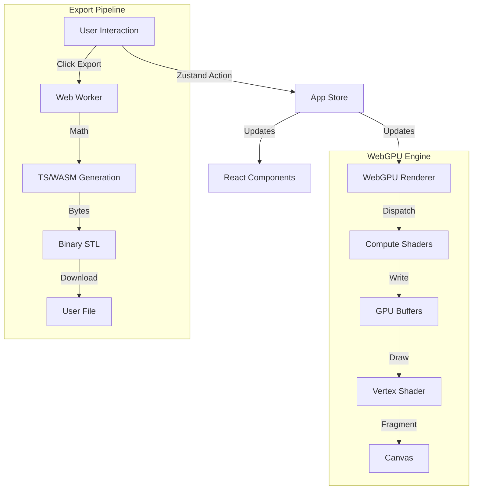

# PotFoundry Architecture

**Version:** 3.1.0 (WebGPU Era)
**Last Updated:** February 2026

## 1. System Overview

PotFoundry uses a **modern client-side architecture** centered around WebGPU for high-performance 3D generation.

### Primary Components

1.  **PotFoundry Web (`potfoundry-web/`)**
    *   **Role**: The production application.
    *   **Tech Stack**: React, TypeScript, WebGPU, WGSL, Zustand, Vite.
    *   **Responsibility**: UI, State Management, Real-time 3D Rendering, Mesh Generation, STL Export.
    *   **Status**: **ACTIVE** (Main Product).

2.  **Python Core (`potfoundry/`)**
    *   **Role**: Reference implementation and geometric backend.
    *   **Tech Stack**: Python 3.10+, NumPy, Pydantic v2.
    *   **Responsibility**: Prototyping algorithms, verifying mathematical correctness, generating "golden" test data.
    *   **Status**: **REFERENCE ONLY** (Not used in the active web app).

> **Note**: The legacy Streamlit UI (`pfui/`) and `app.py` have been archived.

---

## 2. Web Application Architecture

See [potfoundry-web/ARCHITECTURE.md](potfoundry-web/ARCHITECTURE.md) for the deep-dive into the frontend internals.

**Key principles:**
*   **Client-Side computation**: Nothing is sent to a server. Mesh generation happens in the browser.
*   **Reactive State**: Zustand stores drive the UI and GPU buffers.
*   **Compute Shaders**: Heavy geometry logic is pushed to WGSL compute shaders.

---

## 3. Data Flow



### 3.1 The "Hybrid" Pipeline
While the preview is purely GPU-based, the Export process currently uses a separate CPU/WASM path (in `AdaptiveExportComputer.ts`) to ensure 100% robust, watertight meshes that standard GPU rasterization pipelines might gloss over. This "Dual Path" ensures:
1.  **Speed**: 60fps Preview via WebGPU.
2.  **Accuracy**: Watertight, valid STL via comprehensive CPU checks for Export.

---

## 4. Directory Structure

```
PotFoundry/
├── potfoundry-web/      # THE APP (React + WebGPU)
│   ├── src/
│   │   ├── renderers/   # WebGPU/WGSL logic
│   │   ├── components/  # React UI
│   │   └── state/       # Zustand stores
│   └── public/
├── potfoundry/          # REFERENCE (Python Core)
│   ├── core/            # Geometric math
│   └── tests/           # Verification tests
├── archive/             # LEGACY stuff (Streamlit, etc)
└── tests/               # Integration tests
```

---

## 5. Development Philosophy

1.  **Browser First**: All features must run in a standard browser (Chrome/Edge/Firefox Nightly) without backend dependencies.
2.  **Type Safety**: Strict TypeScript in frontend, Pydantic in backend (if used).
3.  **Performance**: Zero-copy where possible. Use TypedArrays.
4.  **Math Purity**: Algorithms should be mathematically derived (e.g. Superformula) rather than approximate.

---
