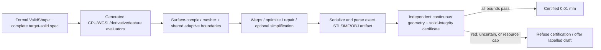

# Perfect meshing / true 0.01 mm audit

**Date:** 2026-07-14  
**Scope:** current `potfoundry-web` export pipeline, recent production artifacts, Tier-C/region-layer work, and the 2026-07 research corpus  
**Decision:** **CURRENT PRODUCT REJECTED** for the claim “true 0.01 mm for every valid style and shape.”  
**Design decision:** **UNANIMOUS ACCEPT** for the corrected certified-surface-complex architecture and G0–G5 gates below.

## Executive verdict

PotFoundry has made real, substantial progress:

- The default conforming assembly is consistently producing watertight, manifold default-style artifacts.
- Feature detection, shared-index assembly, analytic placement, constrained feature edges, metric sizing, whole-population scoring, and the recent DragonScales seam work are valuable building blocks.
- The research has repeatedly found and corrected bad rulers, truth mismatches, seam defects, density aliases, and performance bottlenecks.
- The July production baseline measured large generation-time reductions while retaining byte identity on the tested paths.

But the requested goal is not reached. The gap is not one more density lever. The current system lacks a definition and enforcement chain that can make the claim true:

1. “0.01 mm” is often treated as p99 success, not a continuous maximum bound.
2. Production export validity is topology-focused and does not block on geometric fidelity.
3. Budget scaling and decimation can knowingly spend far more than 0.01 mm.
4. The target surface differs between CPU, WGSL, analytic, and non-default parameter paths.
5. Most advanced work covers only selected outer-wall styles/defaults, not the complete closed solid or parameter envelope.
6. Current rulers are excellent empirical measurements, but finite samples do not prove a supremum.
7. Several paths alter the mesh after their last fidelity measurement or discard convergence failures.

A sound certified mode is achievable for a formally supported shape envelope, with per-artifact proof and honest refusal when proof/resources fail. “Style agnostic” can mean one generic meshing/certification engine consuming a common formal style contract. It cannot mean contract-free handling of unknown discontinuities or topology changes.

## What “true 0.01 mm” must mean

The product contract should separate four claims:

| Claim | Required meaning |
|---|---|
| Geometric tolerance | The **parsed, serialized artifact** has a conservative continuous, two-sided Hausdorff bound to the complete intended boundary of at most 0.01 mm. |
| Topology | Expected connected components/genus/patch adjacency; closed, oriented 2-manifold; no degenerates, duplicate sheets, unintended overlaps, gaps, or self-intersections. |
| Dimensional integrity | Height, drain, rim, wall-thickness semantics, units, and all declared features remain within their specified budgets after transforms and serialization. |
| Manufacturability | Minimum printable feature/thickness and process constraints. This is separate: a 0.01 mm file-space mesh cannot promise a printer will manufacture to 0.01 mm. |

For the geometric claim, define a complete target surface complex `S` and final artifact `M`. A certificate must prove both directed distances:

`max(sup_{x in S} dist(x,M), sup_{y in M} dist(y,S)) <= 0.01 mm`.

For a mesh triangle with a certified, complete, non-degenerate correspondence to one target patch, a validated bound on `sup ||S(u,v)-P(u,v)||` is sufficient for both directions. That shortcut is valid only after proving parameter-domain coverage, orientation/Jacobian non-degeneracy, adjacency ownership, and no gaps/overlaps. Implicit/CSG fallback surfaces need their own certified method.

The numerical margin must be derived, not guessed. A possible budget shape is 0.0095 mm geometry plus at most 0.0005 mm evaluator/Float32/transform/serialization/parser uncertainty, but those allocations must be outward-bounded for each artifact and coordinate range.

## Evidence scorecard

### Strong results that should be preserved

- Shared-index wall/rim/cap assembly and topology-oriented export checks are a strong foundation (`WatertightAssembly.ts`; `realMeshExport.test.ts`).
- The latest complete 20-style production-default capture found all 20 artifacts watertight with zero non-manifold/zero-area findings under its audit.
- Exact analytic placement, protected complexes, seam symmetry, constraint recovery, metric fields, and direct chord/residual refinement have each closed specific mechanisms in controlled cases.
- Numeric keys, persistent hierarchy/cache reuse, typed arrays, prescreens, sharding, and quiet-machine profiling produced genuine performance gains; the July baseline records 81–93% generation-time reductions on pilot styles (`research/lab/E-2026-07-10-PROD-BATCH-prereg.md:800`).
- The raycast/GPU oracle work successfully distinguished bad CPU proxies from real production error, which is exactly the kind of independent metrology needed.

### What the evidence currently establishes

| Evidence | Honest conclusion |
|---|---|
| Complete production-default audit, 2026-07-11 | 3 shipped-clean, 14 regressions, 2 truth-bridge failures, 1 special ruler; all 20 topologically clean. SFB truth was fixed afterward, but no clean full-HEAD re-baseline supersedes this run. |
| Certified GPU frontier audit, 2026-07-12 | Spiral max 0.0469 mm; Gothic max/p99 0.4401/0.1289; Gyroid 0.7241/0.1346. None met 0.01 mm maximum everywhere (`research/lab/2026-07-12-raycast-oracle-fidelity.md:18-36`). |
| Tier-C whole-mesh tests | Useful zero-sampled-outlier evidence on default Gothic/GeoStar patches. Full gates are env-gated; they are patch/default-scale evidence, not full-solid/envelope proof. One assertion permits `max <= 0.0101` (`wholeMesh0Outlier.test.ts:88-149`). |
| DragonScales fineStep winner | `combo|fine|s0.0022`: p99 0.009305, p99.5 0.010005, max 0.056804, and 8,468 sampled outliers over 0.01 (`research/exchange/_dsInteriorClose/witness.ndjson`). This is not literal maximum closure. |
| Latest DragonScales source path | Seam/body improved, but `cb901c2a` explicitly leaves the t=0/1 rim band unresolved; rim-excluded max remains about 0.057 at heavy density. Region/perfect-mesher flags remain off. |
| Parameter coverage | The registry has 20 styles and 174 style controls plus 13 geometry controls. Existing all-20 evidence mostly samples one default point in that continuous space. |

The most damaging terminology drift is visible at `research/EXPERIMENT-REGISTRY.md:13-35`: the experiment is titled “LITERAL 0.01,” but its preregistered close criterion is p99 <= 0.01 and max <= approximately 0.05. The winning row still has 5,099 composite outliers and max 0.049775. That is a useful p99 product target, but it is not a 0.01 mm maximum tolerance.

The DragonScales “REAL src production path” harness proves that the source entry point runs, not that the application’s production configuration passes. Its defaults are `nRing=128`, `sizeRes=192`, and `hMin=0.02` (`_msurf_regionKernel.test.ts:168-175`), while the application derives ring count from its profile, defaults region sizing to 128, and clamps `qMinEdge >= 0.04` (`ParametricExportComputer.ts:2620-2674`). The harness records metrics to NDJSON but contains no fidelity assertions (`_msurf_regionKernel.test.ts:288-309`). A clean capture through the actual UI/export caller is still required.

## Findings

### P0 — production does not enforce geometric tolerance

`summarizeConformingValidation` sets `valid` from manifoldness, orientation, and zero-area degenerates. It computes no target-surface error, reverse coverage, self-intersection, or thickness (`ParametricExportComputer.ts:501-565`). `useParametricExport` blocks only when that summary is invalid (`useParametricExport.ts:412-425`). The legacy branch also describes fidelity and seam findings as advisory (`ParametricExportComputer.ts:7166-7173`).

The UI certificate then:

- marks any available p95 deviation as passing without comparing it to a threshold;
- defines `canPrint` from topology validity/manifoldness only; and
- displays “printable on any FDM/SLA slicer” (`Certificate.tsx:23-78`).

**Required change:** introduce a separate, explicit `Certified 0.01 mm` state that can be issued only by the final-artifact certificate. Rename current `valid`/`tolerancesPassed` semantics to topology/integrity wording. Draft exports can remain available, but must be clearly labelled uncertified.

### P0 — budget actuators invalidate the requested tolerance

The curvature sizing field derives `h = sqrt(8*maxSag/kappa)`, then multiplies `h` by a budget `targetScale` while claiming a minimum-edge clamp preserves sag (`MetricSizingField.ts:95-120`). It does not: sag grows approximately with edge length squared. Cap mode allows a scale up to 4 (`ConformingWall.ts:394,539-579`), which can spend up to 16 times the requested sag. Production telemetry correctly records `capScale^2 * qMaxSag` (`ParametricExportComputer.ts:3253-3259`), but export validity does not reject it.

The hard-budget decimator is more direct:

- its default absolute error ceiling is 0.2 mm (`decimateConforming.ts:107-117,205-275`);
- production seeds at `qMaxSag` but permits the 0.2 mm ladder (`ParametricExportComputer.ts:3274-3289`);
- candidate gates cover triangle quality, folds, topology, and sampled feature retention, not final surface fidelity (`decimateConforming.ts:304-338`);
- a subset of analytic vertices does not make new spanning facets faithful.

**Required change:** certified mode never coarsens tolerance to hit a triangle/file-size budget. Simplification may spend only a conservatively tracked remaining error budget, followed by recertification of the final parsed artifact. Otherwise it refuses.

### P0 — meshes can change after their last fidelity check

- `buildConformingWall` can rebuild on its last verdict pass and return that new wall unscored. If outliers plateau at `maxLevel`, it breaks and returns a known-failing wall (`ConformingWall.ts:1249-1297`). The verdict flag is currently off, but this blocks safe activation.
- Tier-C refines to a sampled zero-outlier state, then symmetrizes seams, pins rims, re-triangulates, and later collapses degenerates without rescoring the adopted result (`noBridgeRefine.ts:1337-1358`; `tierC/index.ts:340-355`).
- The region kernel can stop on max points/rounds, exposes `hitBudget`, and records failed constraint recovery, but `buildMetricOuterWall` discards those channels and returns a wall (`regionMetric.ts:440-486,653-679`). Smoothing/flips also occur after the chord-refinement loop.
- Decimation and output-format conversion likewise occur after earlier metrology.

**Required change:** every geometry-changing step invalidates the prior certificate. Only the exact serialized bytes subsequently parsed and certified may receive the badge.

### P0 — there is no single authoritative target surface

#### Current WaveInterference mismatch

The CPU function negates theta and injects phase into the domain-warp sine (`geometry/styles.ts:778-786`). WGSL uses positive theta and omits phase from that warp (`assets/shaders/styles.wgsl:409-413`). The production audit measured about 0.937 mm p99 vertex disagreement. A mesher cannot certify against an evaluator that describes a different object.

#### Non-default snake/camel parameter mismatch

The style registry/state uses snake_case keys; `buildStyleOptions` copies them unchanged (`useParametricExport.ts:315-334`). GPU packing reads those snake_case names (`utils/styleParams.ts`). `buildAnalyticRadiusFn` instead merges them over camelCase defaults and calls CPU style functions (`geometry/analyticRadius.ts:51-61`). For example, the UI supplies `ds_scale_rows`, while the CPU function reads `dsScaleRows`; the default camelCase value remains active. Styles with hand-added dual aliases are exceptions, not a contract.

This means non-default Tier-C/region “analytic truth” can silently describe a different shape from the rendered/exported WGSL surface.

#### Global twist is outside current analytic/region truth

WGSL applies `theta + TAU*turns*t^curve + phase` (`assets/shaders/styles.wgsl:29-34,1928-1938`). The region kernel lifts `rA(theta,z)` as an unwarped radial surface, and the Tier-C ruler explicitly rejects spin/twist (`interiorRuler.ts:42-72`). Production allows spinTurns in [-3,3]. Default spin-zero scorecards do not cover this domain.

**Required change:** define one canonical semantic IR and parameter schema, then generate WGSL, CPU Float64, derivatives/features, and validated interval evaluation. The certification oracle remains independent validated numerics, not WGSL itself. Differential CPU/GPU tests must cover defaults, every parameter boundary, interactions, seams, and fuzzed valid cases.

### P0 — current representation and scope are outer-wall/default centric

The advanced adoption hook replaces only surface 0, the outer wall. Yet the shader builds the inner surface from the same styled outer radius and subtracts wall thickness radially (`assets/shaders/styles.wgsl:1947-1959`). Assembly calls that inner wall a “smooth offset” and supplies none of the outer feature lines, analytic floor, Tier-C wall, or region treatment (`WatertightAssembly.ts:556-602`). Either the target intends a smooth inner wall—in which case the shader is wrong—or it intends a styled radial offset—in which case inner fidelity is under-treated and radial thickness is not normal thickness.

Rims, base, drain, and seam also sit outside the outer-wall rulers. DragonScales’ current fixed-`nRing` rim residual is a direct consequence. A split requested by one adjacent surface must propagate through a globally shared boundary registry.

Several valid style functions are not smooth radial sheets. ArtDeco uses floors/steps; weave/cell styles contain branch and crossing semantics. A single vertex per `(u,t)` cannot represent both one-sided values and the physical curtain/riser face at a C0 jump. More density across the jump creates a bevel/bridge, not the intended discontinuity.

**Required change:** the target is a piecewise closed **surface complex**: smooth patches, one-sided boundaries, explicit curtain/riser patches, periodic identifications, patch adjacency, crease/feature curves, inner surface, rim/base/drain, and closure ownership. The generic mesher consumes this contract; it does not infer missing topology from samples.

### P0 — “valid shape” is not a meshing contract

There are 13 bounded geometry fields (`state/types.ts:17-77`), but relational validation checks only base wall thickness, drain radius, and minimum height (`state/slices/geometry.ts:86-112`). Style options are merged without schema validation/clamping in the state slice, and export does not enforce regularity of the final styled solid.

Missing validity conditions include, at minimum:

- finite and positive radii/Jacobians on every smooth patch;
- declared topology/branch regime and no unintended topology transition;
- inner/outer clearance and minimum physical thickness;
- no self-contact/intersection after bell, style relief, twist, and phase;
- feature separation above the representable/certifiable floor;
- legal drain/rim/cap containment after the full style transformation;
- bounded evaluator spectrum/derivatives or a fallback representation.

**Required change:** make `ValidShape` a blocking export precondition over the authoritative final target, not merely independent UI slider bounds.

### P0 — present rulers are empirical, not continuous proofs

- Region chord guarding defaults to four locations per facet and measures distance to the supporting plane, not a certified closest distance to the finite triangle (`regionMetric.ts:323-350`).
- Tier-C’s dense guard is 45 barycentric sites per facet plus a finite nearest-surface search (`interiorRuler.ts:145-187,285-379`).
- Production diagnostics commonly report percentiles and may use one centroid or proxy curvature/dihedral metrics.
- `p99 <= 0.01` permits 1% of a large mesh to exceed 0.01. The current DS 2.64M-triangle winner demonstrates this directly.

Finite samples are excellent screens and regression metrics. They are not proof that no unsampled interior maximum exists.

**Required change:** use GPU/sample screens to reject obvious red and accept only provably green cases; send uncertain cells/facets to validated interval/affine/Taylor branch-and-bound. Prove both directed bounds on the final artifact with outward rounding and bind the certificate to target/config/units and artifact hashes.

### P1 — current tests do not span the claim

- The complete 20-style run uses defaults, not parameter minima/maxima or interactions.
- `rebaseline20.test.ts` explicitly accepts per-style terminal concessions rather than blanket literal zero and delegates count-unstable fidelity to patch-scale tests (`rebaseline20.test.ts:17-109`).
- Heavy fidelity gates are env-gated; a static audit found 608 `skip`/`skipIf` occurrences in research bridge tests and 32 in Tier-C source tests. These counts are occurrences, not unique cases, but they show why normal `npm test` is not a fidelity certification run.
- Much experimental data lives in gitignored exchange directories; several production audits were tree-basis or uncommitted runs.
- The latest July 12–14 source changes do not have a fresh clean-tree all-style production artifact certificate.

**Required change:** distinguish always-on unit/regression tests, scheduled heavy empirical matrices, and runtime proof. Parameter fuzz/property tests increase confidence but cannot prove universality; the runtime certificate supplies soundness.

### P1 — solid integrity and product claims are incomplete

The self-intersection detector explicitly says it is warning-only and not wired into the blocking export gate (`geometry/selfIntersection.ts:1-16`). Current export validation checks finiteness, indices, degenerates, welded edge use/orientation, volume sign, and size; it does not check target fidelity, self-intersection, patch correspondence, extra shells/containment, or continuous thickness (`geometry/exportValidation.ts:220-364`).

Certified mode must block on robust global self-intersection, intended components/genus/adjacency, positive volume, minimum physical thickness, feature correspondence, and all-surface coverage. The “printable on any slicer” UI claim should be narrowed even outside certified mode.

## Accepted target architecture

### 1. Canonical semantic IR

One versioned target specification generates:

- canonical parameter names, types, units, bounds, and normalization;
- CPU Float64 and WGSL evaluation;
- derivatives/curvature or conservative derivative bounds;
- branch, crease, seam, and discontinuity manifests;
- validated interval evaluation suitable for an independent oracle.

Preview and export consume the same semantics. The certificate records evaluator/spec hashes, parameters, units, transforms, and artifact hash.

### 2. Complete surface-complex target

Each instance supplies regular smooth patches, adjacency and ownership, periodic seam identifications, C0/C1 feature curves, explicit curtain/riser faces, inner-surface semantics, rim/base/drain/cap patches, and intended topology. Use an implicit/CSG fallback when the supported target cannot remain a single radial graph.

### 3. Universal conforming mesher

Reuse the successful pieces—metric sizing, constraint recovery, shared indices, protected boundaries—but make the machinery contract-driven rather than style allow-listed. Maintain a shared adaptive boundary registry so adjacent patches use identical split stations. Treat metric/curvature/sample scores as accelerators, not the correctness proof.

### 4. Final-artifact validated certificate

After every mutation and serialization:

- parse the exact artifact coordinates;
- prove continuous two-sided geometric error with outward bounds;
- prove patch/domain correspondence or use a certified implicit alternative;
- accumulate evaluator, Float32, transform, serialization, and parser error;
- block on topology, self-intersection, feature correspondence, thickness, dimensions, and target hashes.

### 5. Fail-closed certified mode

Constraint recovery failure, max-pass/point/time/memory exhaustion, dropped features, proof uncertainty, or an exceeded numerical budget means **no certificate**. It may offer an explicitly labelled draft export; it must not weaken tolerance silently.

## Performance and quality gains

Correctness contracts come first; then optimize the proof and candidate generation:

1. **Do not globally brute-force every facet.** Use cheap analytic/sampled upper bounds and GPU batches for obvious greens/reds; run interval branch-and-bound only on uncertain cells.
2. **Use patch-local residual queues.** Refine only the cells whose bound fails and invalidate only neighbouring certificates.
3. **Replace full region re-triangulation.** `regionMetric.ts:427-486` allocates scaled coordinates and full XYZ and rebuilds Delaunator every round (up to 60), then performs optimization sweeps. Prefer deterministic incremental cavity insertion or metric candidate generation followed by one constrained triangulation.
4. **Move validated numerics to worker/WASM pools.** Use typed SoA buffers, shared/cancellable work queues, BVHs, cached derivative/interval tiles, and bounded memory.
5. **Unify topology/orientation work.** Assembly, export validation, and STL writing repeat global scans, string-key maps, adjacency construction, and copies. Replace string edges with packed numeric/radix-sorted edges and carry a trusted orientation contract—but retain final topology/winding validation until every emitter/warp proves local consistency.
6. **Use real streaming/output caps.** A 16M-triangle binary STL is about 800 MB. The current “streaming” writer retains chunks before Blob construction; STL/3MF can therefore coexist with multi-GB mesh/intermediate data. Use a writable file/stream sink where supported, workers, honest browser caps, and cancellation.
7. **Derive sampler resolution from the target.** Fixed 256/512 surface grids and 128 metric grids cannot be universal under high style frequencies/warps. Use conservative spectrum/derivative bounds or bypass sampled truth in certified export.
8. **Preserve exact features before angle optimization.** Arbitrarily acute valid target corners can force poor element angles. Geometry/topology are hard constraints; triangle quality is optimized second and may require documented constrained-feature exceptions.

## Acceptance gates and roadmap

### Immediate containment

1. Stop using “literal,” “true,” “perfect,” or `tolerancesPassed` for sampled percentile/topology-only results.
2. Present the existing export as high-quality/topology-validated, not 0.01-certified.
3. Fix WaveInterference parity and centralize snake/camel parameter normalization before further analytic conclusions.
4. Add regression tests that intentionally demonstrate p99 pass/max fail, post-check mutation, budget coarsening, decimation bridging, non-default parameters, and twist.
5. Run a fresh clean-HEAD all-20 default artifact baseline after truth fixes; retain it as empirical status, not universality proof.

### G0 — target and validity specification

Publish the formal supported validity envelope and complete target-solid semantics: units, one-sided discontinuities/curtains, seams, inner/rim/base/drain/caps, thickness semantics, topology, degeneracy exclusions, and resource/refusal contract.

### G1 — evaluator parity

Land the generated semantic contract and independent validated evaluator. Prove CPU/WGSL/derivative/feature parity at parameter corners, branch boundaries, seams, transforms, and fuzzed valid cases with an error budget comfortably below 0.01.

### G2 — final-artifact certification

Implement independent continuous two-sided certification for parsed STL and 3MF (then OBJ), plus robust topology, self-intersection, feature, dimensional, and thickness gates. Include adversarial counterexamples that defeat the old finite rulers.

### G3 — full production matrix

Every one of 20 styles: defaults, each min/max, pairwise/interacting parameters, geometry-envelope boundaries, twist/phase/seam, and every surface class (outer, inner, rim, base, drain, cap). Every artifact either certifies max <= 0.01 with its derived margin or refuses honestly. No default-off lab substitute counts as shipment evidence.

### G4 — resource and UX contract

Certified export meets an explicit cross-browser memory/time/cancellation SLA or refuses. No triangle budget or timeout changes the tolerance. Draft modes remain clearly distinct.

### G5 — release evidence

Fresh clean-tree rerun, committed machine-readable artifacts/certificates, independent verifier implementation, serialization round-trip checks, and GitNexus `detect_changes()` before shipment.

## Validation performed for this audit

- Refreshed the GitNexus index at `cb901c2a` and traced the production exporter, target evaluators, conformity paths, assembly, validation, and writers.
- `npm run typecheck`: **PASS**.
- `npm run lint`: **PASS**, zero warnings.
- `npm test`: **FAIL** after 1,769.4 seconds, with 34 failing tests and 2 unhandled worker-start errors. Concurrent heavyweight research processes caused broad timeout pressure, so timeout-only failures are not attributed to this review. Deterministic failures also remain, including the missing `edgeKey` function in `BoundaryTJunctionRepair.test.ts`, T-junction repair expectations, doubled production-scale interior-boundary counts, and the Voronoi truth-coverage assertion.
- No production source was modified. This audit adds documentation and the required append-only journal sign-off only.
- GPU/browser certification fleets and environment-gated research arms were not rerun; the report cites their committed evidence and machine-readable witnesses instead.

## Debate record and Master decision

- **Generator:** ACCEPT the certified surface-complex architecture; REJECT the current universal claim.
- **Verifier:** ACCEPT the architecture with validated-numerics, full-solid/topology correspondence, derived margin, and fail-closed conditions; REJECT current evidence.
- **Executioner:** ACCEPT, conditional on worker/WASM memory, cancellation, wall-time, cross-browser gates, and retaining final winding/topology validation until emitters are proven.
- **Master:** **APPROVE the architecture and G0–G5 roadmap unanimously. REJECT enabling or advertising “true 0.01 mm for all valid shapes” until G0–G5 pass.**

GitNexus impact analysis confirms implementation must be staged: `buildConformingWall` and `assembleWatertight` are CRITICAL-risk hubs (157 and 108 affected symbols); `buildStyleParamPayload` is also CRITICAL (98 affected symbols across 7 execution processes). Use narrow phases, default-off integration flags, differential tests, and a clean re-baseline after each phase.

## Bottom line

PotFoundry is not missing a magic meshing parameter. It is missing a proof-preserving product contract from target semantics through final bytes. The research already contains many of the right candidate-generation mechanisms. The shortest credible route is to stop asking those heuristics to be the proof, unify the target truth, represent discontinuities and all solid surfaces explicitly, and make an independent final-artifact certificate the only authority allowed to say “0.01 mm.”
