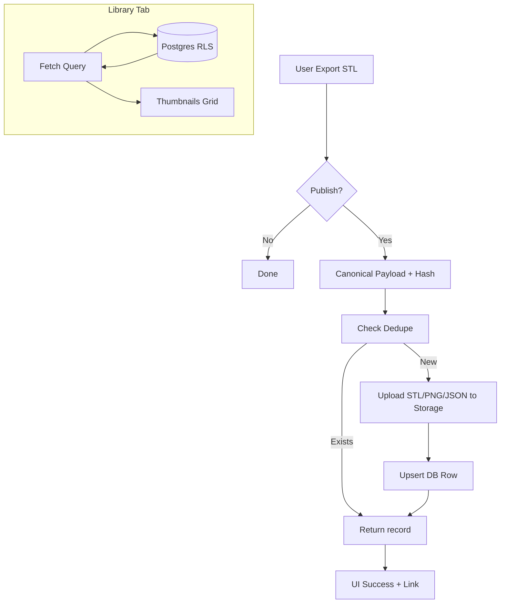

# Public Library Publishing Feature

## 1. Scope
Provide an optional workflow that, after exporting an STL, lets the user publish the design to a **public, browsable library** backed by Supabase (Postgres + Storage). Each published entry stores:
- STL file (binary; optionally gzip if > 1MB)
- PNG thumbnail (deterministic snapshot)
- Canonical JSON metadata (parameters, style, mesh quality, options, diagnostics, commit SHA)
- Tags, title, license (explicit user consent)
- Content hash = SHA-256(canonical JSON) used as primary key and dedupe mechanism

### In Scope
- Publish controls in Export UI
- Canonical payload + deterministic hashing
- Upload assets to Supabase Storage bucket `pots`
- Upsert row in `pots` table with RLS policies (public read, controlled write)
- Library browsing tab with search/filter/pagination
- Deep link to rehydrate design state into editor
- Rate limiting (client/session level) + size validation + blocklist
- Observability: structured logs for publish, browse, deeplink events

### Out of Scope / Non-goals
- User accounts / per-user dashboards (future work)
- Editing published geometry (immutable by content hash; only tags/title re-updatable)
- Private / access-controlled sharing
- Version diff UI (hash based dedupe covers identical content)

## 2. Architecture Overview



### Data Flow
1. Gather current parameters (size, opts, mesh settings, style, diagnostics).
2. Build canonical JSON (stable ordering, trimmed floats) → bytes
3. SHA-256 → `id`
4. If row with `id` exists: fetch + return (avoid duplicate storage ops)
5. Else: upload `stl/{id}.stl`, `thumb/{id}.png`, `meta/{id}.json`
6. Insert row with metadata and URLs (public paths)
7. UI surfaces success & deep-link query param to restore state

## 3. Data Model (Postgres)
`pots` table (see migration):
- `id` (PK, text) – sha256 hex
- `title` text
- `style` text
- `size` jsonb {height, top_od, bottom_od, wall, bottom, drain, flare_exp}
- `opts` jsonb – style option values
- `mesh` jsonb – {n_theta, n_z, preview_detail, twist, etc.}
- `stl_url` text
- `thumb_url` text
- `created_at` timestamptz default now()
- `tags` text[]
- `app_commit` text (git commit SHA)
- `diagnostics` jsonb (health metrics, triangle count)
- `license` text (e.g. 'CC BY-NC 4.0')

Indexes:
- PK on id
- GIN on tags for tag search
- btree on style, created_at

## 4. Canonical JSON & Hashing
Key requirements:
- Deterministic key ordering: `json.dumps(obj, sort_keys=True, separators=(",", ":"))`
- Float trimming: round to 6 decimals to avoid inconsequential differences
- Remove transient fields (timestamps, performance logs)
- Include: version, style, size, opts, mesh, diagnostics minimal, license

## 5. Deduplication Strategy
If `id` exists in table: skip uploads; optionally ensure missing assets are healed (future). This prevents uploading same design multiple times and allows quick retrieval.

## 6. Security & Privacy Model
- Public read (RLS allows SELECT for anon)
- INSERT restricted to service role key (feature runs server-side in Streamlit with secret)
- UPDATE limited: allow updating `title`, `tags` if same service key (optional future) — omitted initially for immutability
- Blocklist validation: reject titles/tags containing banned substrings
- License consent required: checkbox and license dropdown; cannot publish otherwise
- No personally identifiable info captured beyond what user types into title/tags

## 7. RLS Policies (Summary)
```sql
ALTER TABLE public.pots ENABLE ROW LEVEL SECURITY;
CREATE POLICY pots_select ON public.pots FOR SELECT USING (true);
CREATE POLICY pots_insert ON public.pots FOR INSERT WITH CHECK (auth.role() = 'service_role');
```
Optionally, define a restricted function wrapper if needed.

## 8. Storage Bucket
Bucket: `pots`
Objects:
- `stl/{id}.stl`
- `thumb/{id}.png`
- `meta/{id}.json`
Public read policy (signed off in Supabase dashboard) & write only with service key.

## 9. Rate Limiting & Abuse Controls
- Client-side: maintain publish timestamps in `st.session_state`; enforce 1 publish / 10s (burst 5 sliding window)
- Max STL size: 25 MB (post-gzip if compressed)
- Reject if number of triangles > threshold (e.g. 5M) to mitigate cost
- Validate: title length (1..120), tags count (<=10), each tag <=24 chars
- Blocklist e.g. in-memory set; case-insensitive search

## 10. Telemetry & Logging
Structured dictionaries appended to a central log list (`_pub_logs`):
- `publish_attempt`, `publish_success`, `publish_fail`, `library_view`, `deeplink_apply`
Future: integrate with external logging endpoint.

## 11. Failure Modes & Handling
| Failure | Handling |
|---------|----------|
| Supabase not configured | Hide publish controls; export flows unaffected |
| Network error uploading STL | Retry (3 attempts w/ backoff), then user error message |
| Hash collision (theoretical) | Treat as duplicate; show message referencing existing entry |
| Oversized file | Abort before upload; surface message |
| RLS misconfiguration | Insert fails -> show admin diagnostic, log event |
| Blocklist match | Reject pre-flight |

## 12. Rollback Plan
Feature flag: if missing `supabase.url` or `supabase.key` or env `DISABLE_LIBRARY=1` → skip all library UI & controls. Rollback = unset secrets / set flag. DB artifacts remain harmless.

## 13. Testing Strategy
- Unit: canonical normalization stable ID, hashing unaffected by key order
- Unit: thumbnail deterministic (compare hash of bytes)
- Unit: client fallback (no config) returns NotConfigured sentinel
- Integration (mocked Supabase): publish flow path (dedupe vs new)
- UI: library listing filter logic (pure functions separated from Streamlit)
- Golden meta JSON sample

## 14. Release Plan
1. Deploy migration + bucket
2. Add secrets in Streamlit Cloud
3. Merge feature branch
4. Smoke test publish (small design)
5. Validate library tab query (search, tags)
6. Announce feature + add screenshot to README

## 15. Acceptance Criteria Checklist
- [ ] Migration applies cleanly (pots table + policies)
- [ ] Upload disabled when secrets absent
- [ ] Publish deduplicates by hash
- [ ] Thumbnails generated deterministically
- [ ] Library tab paginates & filters by style, tags, title substring
- [ ] Deep link restores state (geometry & style values)
- [ ] License recording mandatory
- [ ] Rate limiting enforced (manual test)
- [ ] All tests pass (>=75% coverage)
- [ ] Docs & ADR merged

## 16. Future Enhancements (Documented Only)
- User accounts / oauth for attribution
- Editable descriptions & rating system
- Webhook or queue for async thumbnail variants
- CDN cache invalidation metrics

